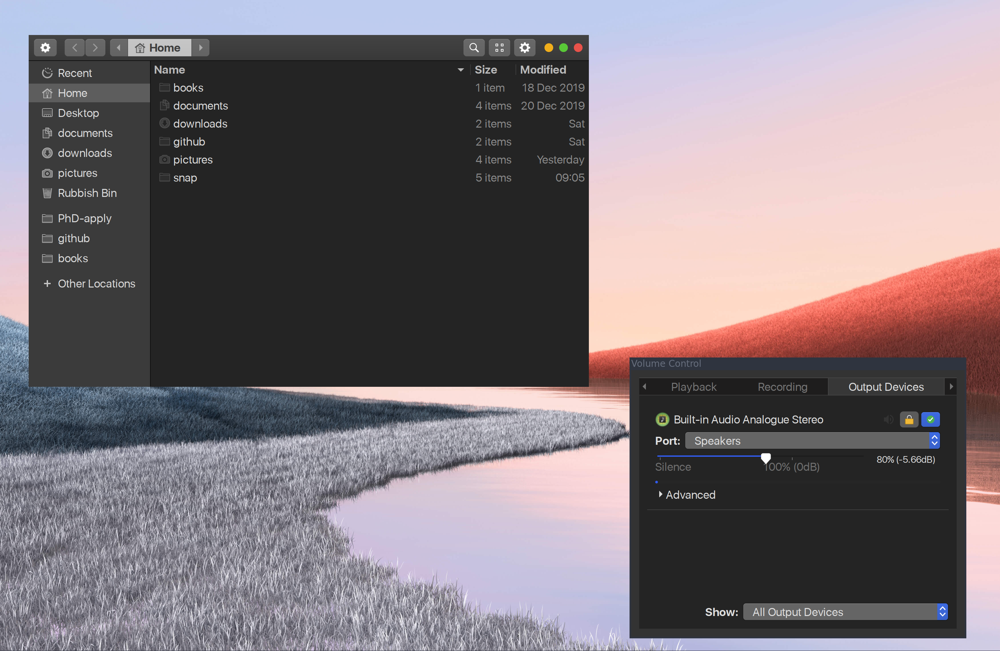

I know i3 - **titling window manger** from my friend - Hales and he has been using it for many years.  Impressed by its simplicity and high-efficency, I decided to transfer from Gnome-destop (diverse functions and user-friendly UI but *slow*!) to  it.

---
## Installation
**i3wm installation** command line:<br>
```console
	sudo apt-get install i3
```

This brings you i3-wm, [i3status](#i3status) and i3lock.

After it is done, reboot your computer and choose i3 as your window manager before you login.

**Additional packages** which I recommend:

- **Typora**: markdown editor with awesome and user-friendly  UI to help me write online posts.
- [**Rofi**](#Rofi): program launcher similar with
- [Lxappearance](#Lxappearance)
-  

---
## HiDpi problem
My laptop is surface-book 1st with the resoultion of 3000$\times$2000. The first problem which I came across is that the fonts are very small and hardly readable. After wandering around stackoverflow, I found the solution [here](https://unix.stackexchange.com/questions/267885/how-do-i-scale-i3-window-manager-for-my-hidpi-display). Bascillay, you could modify .Xresources file (located at `~/.Xresources`) where Xft.dpi should be increased (220 works perfectly in my case) and reboot you should see the difference. 

---

## Appearance and Fonts

I am simply in favor of MacOS Fonts and UI and this section would focus on how I customise it.    

### <a name = "Lxappearance"></a>Lxappearance 

This software helps you customize the following<br>
* Widget theme: located at `~/.themes`
* Fonts: located at `~/.fonts` 
* Icon theme: located at `~/.icons`
* Cursor theme: located at `/usr/share/icons`
For my personal taste, [MacOs theme](https://www.gnome-look.org/p/1275087/) is chosen (the visual effect as shown below).


## Infinality

Font rendering, installation see here [Ubuntu Forum](https://ubuntuforums.org/showthread.php?t=2385152)

---

## <a name = "i3status"></a>i3config

**File location** in ubuntu 18.04.3 LTS (found with the following command line) <br>

```console
lsb_release -a
```


---
## i3bar configuration 

i3bar could be configured in the same configuration file as i3-wm. Configuring your workspace bar starts with opening a `bar` block with the following choices:  

* i3status

  ```console
  bar {
      status_command i3status
  }
  ```

* i3blocks

* polybar

Reason to choose i3status: originally come with i3; good enough to satisfy all my needs.

First I want to specifies the alternate configuration file path same as i3 config file.

```console
bar {
    status_command i3status --config ~/.i3status.conf
}
```

I choose t comment out some issues (no Ethernet port for my laptop & not interested in cpu tempe.)

```c
order += "wireless wlp3s0"
order += "battery 1"
order += "load"
order += "volume master"
order += "tztime local"
order += "disk /"
order += "disk /home"
#order += "ethernet enp1s0"
#order += "cpu_temperature 0"
```

Wireless connection could be found use ```iwconfig``

The font symbol is found here: [Font Awesome](https://fontawesome.com/v4.7.0/cheatsheet/). Finally it gives this!


Details could be found: ```man i3status```, [i3 User’s Guide](https://i3wm.org/docs/userguide.html) and [my dotfiles](https://github.com/EeToSe/i3dotfiles)


---
## Reference
* Offical documents: [i3 User’s Guide](https://i3wm.org/docs/userguide.html)
* Series of screencasts: [i3 Youtbue](https://www.youtube.com/playlist?list=PL5ze0DjYv5DbCv9vNEzFmP6sU7ZmkGzcf)
* i3-starterpack: [i3dotfiles Github](https://github.com/addy-dclxvi/i3-starterpack) 